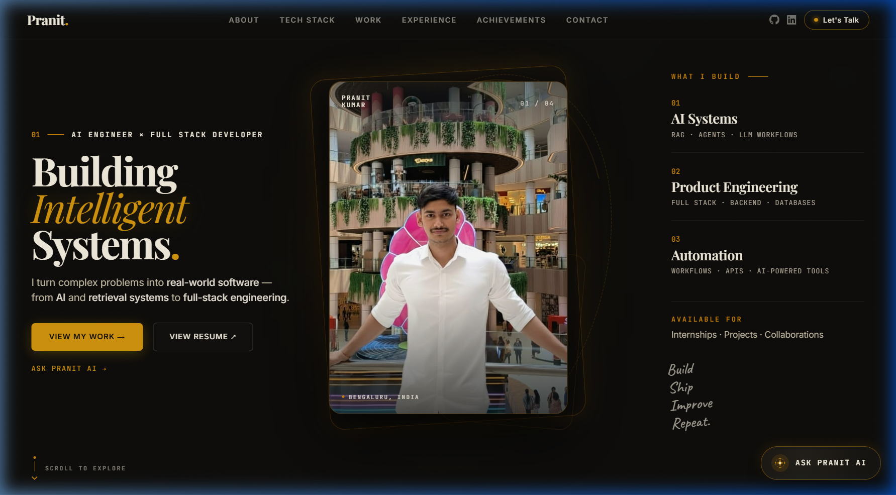
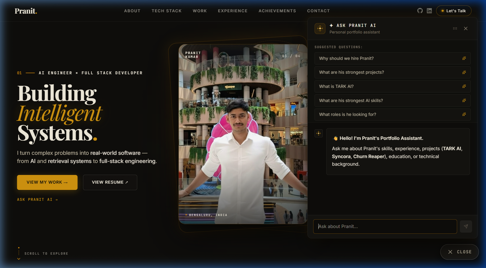
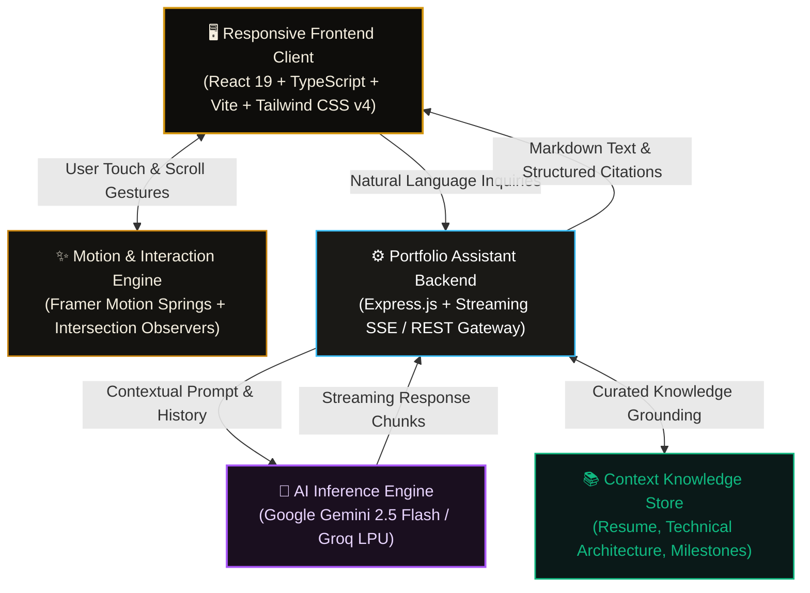

# ⚡ Pranit Kumar — AI Systems Engineer & Full-Stack Developer | Digital Identity & Interactive AI Portfolio

[](https://react.dev/)
[](https://www.typescriptlang.org/)
[](https://vite.dev/)
[](https://tailwindcss.com/)
[](https://www.framer.com/motion/)
[](https://nodejs.org/)
[](https://expressjs.com/)
[](https://deepmind.google/technologies/gemini/)
[](https://opensource.org/licenses/MIT)

---

## 1. Overview

Welcome to the digital portfolio and interactive identity of **Pranit Kumar** — a pre-final year Computer Science Engineering student, AI Systems Engineer, and Full-Stack Developer based in Bengaluru, India.

This portfolio is not just a static showcase; it is a **high-performance, production-ready web application** engineered with modern aesthetic principles:
- **Obsidian Dark & Warm Amber Theme**: Sleek, distraction-free visual language blending editorial typography (`Playfair Display`, `Cormorant Garamond`, `JetBrains Mono`, `Inter`) with subtle glowing glassmorphism.
- **Interactive Scroll-Expansion Hero**: Physics-based 3-zone viewport with adaptive scroll locking on desktop and a clean, responsive flexbox layout on mobile.
- **Embedded AI Portfolio Assistant**: A context-aware RAG-powered chatbot powered by **Google Gemini 2.5**, capable of answering technical questions about my architecture, projects, internships, and skillset in real-time.
- **Interactive Project Archives**: Tactile 3D fanned screenshot folders for flagship applications (**TARK AI**, **Syncora**, **Churn Reaper**) with interactive fullscreen lightboxes and dedicated AI sub-assistants.
- **Flawless Cross-Device Responsiveness**: Handcrafted fluid typography, zero layout shift, adaptive touch gestures, and optimized layout trees for devices ranging from 320px mobile screens to 4K desktop monitors.

---

## 2. Application Showcase

### 🌟 1. Interactive 3-Zone Hero & Responsive Digital Identity
> A cinematic desktop entrance featuring physics-driven spring expansion, warm amber atmospheric glow, and editorial layout — seamlessly paired with an optimized mobile flexbox hierarchy with zero text overlap.



---

### 🤖 2. Context-Aware AI Portfolio Assistant & Interactive Projects
> An integrated conversational intelligence window powered by Gemini 2.5 that answers recruiter queries on demand, alongside interactive fanned project folders and technical milestone timelines.



---

## 3. Flagship Projects

### 🧠 1. [TARK AI — Agentic AI Workspace & Personal Productivity OS](https://github.com/gpranit16/tark-ai)
- **Architecture**: Autonomous agentic OS built with **LangGraph**, **FastAPI**, **PostgreSQL / pgvector**, and modern React.
- **Key Capabilities**: 44 registered tool integrations with AST sandboxed execution, hybrid semantic/keyword search with CRAG (Corrective RAG), persistent multi-turn memory graph, and multi-model routing.
- **Impact**: Unifies coding, research, task planning, and conversational reasoning into an offline-first, private personal operating system.

### ⚡ 2. [Syncora — Enterprise Real-Time Collaboration & AI Workspace](https://github.com/gpranit16)
- **Architecture**: Low-latency multi-party collaboration platform built with **React 19**, **Node.js / Express**, **Socket.io**, **WebRTC**, and **MySQL / TiDB**.
- **Key Capabilities**: Peer-to-peer audio/video calling with screen sharing, WhatsApp-style channels and DMs, automated AI meeting summaries and structured transcripts via Gemini, and interactive Kanban boards with conversational task extraction.
- **Performance**: Sub-50ms message propagation with deterministic room routing and real-time presence telemetry.

### 📊 3. [Churn Reaper — Applied ML & Customer Retention Intelligence](https://github.com/gpranit16)
- **Architecture**: Predictive machine learning platform utilizing **XGBoost**, **FastAPI**, and **Interactive Data Visualizations**.
- **Key Capabilities**: Real-time churn probability scoring, SHAP-value feature attribution explainability, dynamic revenue risk simulation, and automated AI retention strategy recommendations.
- **Outcome**: Empowers product teams to proactively identify at-risk customer cohorts and prevent recurring revenue losses.

---

## 4. System Architecture



---

## 5. Engineering & Responsive Design Highlights

1. **Adaptive Scroll-Expansion Hero**:
   - **Desktop**: Physics-based spring controller (`stiffness: 55, damping: 22`) smoothly expands the central portrait card from a focal card into a full-bleed backdrop during initial scroll.
   - **Mobile**: Automatically detects mobile viewports and transitions to a responsive vertical flex layout, ensuring high legibility and zero collision between text and images.
2. **Context-Aware Streaming AI Assistant**:
   - Floating draggable window with server-sent event streaming, suggested prompt quick-triggers, automatic scroll anchoring, and responsive mobile bottom-sheet styling.
3. **Tactile Interactive Archive Folders**:
   - Stacked multi-layer screenshot folders that fan out on hover or click using spring physics, backed by full-screen modal lightboxes with keyboard shortcuts (`ArrowLeft`, `ArrowRight`, `Esc`) and swipe navigation.
4. **Performance & Clean Code**:
   - 100% TypeScript type safety.
   - Vite 6 build optimization resulting in sub-second initial page load and high Lighthouse scores.
   - Strict CSS constraints eliminating horizontal viewport shake across all mobile browsers.

---

## 6. Technical Stack

| Layer | Technology | Purpose & Capabilities |
| :--- | :--- | :--- |
| **Frontend Framework** | React 19, TypeScript, Vite 6 | Ultra-fast client-side rendering, modular components, strict type safety |
| **Styling & Design System** | Tailwind CSS v4, Custom CSS Tokens | Obsidian pitch-black base, glassmorphism, responsive clamp typography |
| **Animation Engine** | Framer Motion | Spring physics, scroll-linked animations, tactile gesture feedback |
| **Icons & Typography** | Lucide React, Google Fonts | Clean vector icons, bespoke font pairings (*Playfair, JetBrains Mono, Inter*) |
| **Backend Service** | Node.js, Express.js | API routing for contact forms and AI assistant streaming endpoints |
| **AI LLM Engine** | Google Gemini 2.5 Flash | Real-time conversational portfolio assistant with grounded context |
| **Deployment** | Vercel / Cloudflare | Global edge delivery, automated CI/CD pipelines, instant invalidation |

---

## 7. Local Setup & Installation

### Prerequisites
- **Node.js** (v18.x or higher)
- **npm** or **pnpm** / **yarn**
- *(Optional)* **Gemini API Key** (for local AI assistant chat)

---

### 1. Clone the Repository
```bash
git clone https://github.com/gpranit16/portfolio.git
cd portfolio
```

---

### 2. Install Dependencies
```bash
npm install
```

---

### 3. Environment Configuration
Create a `.env` file in the root directory:
```env
PORT=3001
GEMINI_API_KEY=your_gemini_api_key_here
```

---

### 4. Start Development Servers
To start the Vite frontend:
```bash
npm run dev
```

To start the local backend server (for contact form & AI chat):
```bash
npm run server
# or: node server.js
```

Open your browser and navigate to **`http://localhost:5173`**.

---

### 5. Build for Production
```bash
npm run build
```
The optimized production bundle will be generated in the `dist/` directory.

---

## 8. Connect & Contact

- **Name**: Pranit Kumar
- **Role**: AI Systems Engineer & Full-Stack Developer
- **Email**: [guptapranit34@gmail.com](mailto:guptapranit34@gmail.com)
- **Phone**: [+91 9508746855](tel:+919508746855)
- **GitHub**: [github.com/gpranit16](https://github.com/gpranit16)
- **LinkedIn**: [linkedin.com/in/pranit-kumar-378342357](https://linkedin.com/in/pranit-kumar-378342357)

---

## 9. License

Distributed under the **MIT License**. See `LICENSE` for more information.

---

<div align="center">
  <sub>Designed &amp; Engineered with precision by <strong>Pranit Kumar</strong></sub>
</div>
